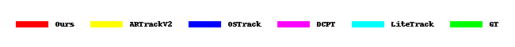

# UMDATrack
The official implementation for the ICCV 2025 paper "UMDATrack: Unified Multi-Domain Adaptive Tracking
Under Adverse Weather Conditions".

## Demo




## Install the environment

Create and activate a conda environment:
```
conda create -n UMDATrack python=3.8
conda activate UMDATrack
```
Then install the required packages:
```
bash install.sh
pip install -r requirements.txt
```

## Set project paths

Run the following command to set paths for this project
```
python tracking/create_default_local_file.py --workspace_dir . --data_dir ./data --save_dir ./output
```
After running this command, you can also modify paths by editing these two files
```
lib/train/admin/local.py  # paths about training
lib/test/evaluation/local.py  # paths about testing
```

## Dataset Preparation

Put the tracking datasets in ./data. It should look like this:
```
${PROJECT_ROOT}
 -- data
     -- lasot
         |-- airplane
         |-- basketball
         |-- bear
         ...
     -- got10k
         |-- test
         |-- train
         |-- val
     -- coco
         |-- annotations
         |-- images
     -- trackingnet
         |-- TRAIN_0
         |-- TRAIN_1
         ...
         |-- TRAIN_11
         |-- TEST
     -- got10k_dark
         |-- test
         |-- train
         |-- val   
     -- got10k_haze
         |-- test
         |-- train
         |-- val 
     -- got10k_rainy
         |-- test
         |-- train
         |-- val         
``` 
The synthetic multi-domain datasets are now available for downloading at ([BaiduNetdisk:lite](https://pan.baidu.com/s/1Xsn45GZEI35vkv6jEQ0ZHA?pwd=wi9a))

## Training

Download our pre-trained [foundation model and initial pseudo-labels](https://pan.baidu.com/s/1Xsn45GZEI35vkv6jEQ0ZHA?pwd=wi9a) which is based on our backbone and put it under  `$PROJECT_ROOT$/pretrained_models`.   
Run the command below to train the model:

### The first stage for the overall training

Since this is a semi-supervised learning setup, please place the initial pseudo-labels in the output folder (e.g., `./output/pseudo_label`), and execute the following command:
```
python tracking/train.py --script UMDATrack --config vit_256_ep250_all --save_dir ./output --mode multiple --nproc_per_node 4  --use_wandb 0
```
Replace `--config` with the desired model config under `experiments/UMDATrack`. We use [wandb](https://github.com/wandb/client) to record detailed training logs, in case you don't want to use wandb, set `--use_wandb 0`.

### The second stage for the domain-customized adapter training

We perform domain adaptation for three weather conditions (dark, haze, rainy). You can find the corresponding configuration files under `experiments/UMDATrack`, and modify the config parameters there to adapt to different domains.Just use dark doamin for instance:
```
python tracking/train.py --script UMDATrack --config vit_256_ep50_dark --save_dir ./output --mode multiple --nproc_per_node 4  --use_wandb 0
```

## Evaluation
Use your own training weights or ours([BaiduNetdisk:lite](https://pan.baidu.com/s/1Xsn45GZEI35vkv6jEQ0ZHA?pwd=wi9a)) in `$PROJECT_ROOT$/output/checkpoints/train/UMDATrack`.  

Change the corresponding values of `lib/test/evaluation/local.py` to the actual benchmark saving paths

Testing examples in different domains:
- DTB70 for darkness or other off-line evaluated benchmarks (modify `--dataset` correspondingly)
```
python tracking/test.py UMDATrack vit_256_ep50_dark --dataset dtb70_dark --runid 0001 --ep 50 --save_dir output
python tracking/analysis_results.py # need to modify tracker configs and names
```
- GOT10K-haze(our synthetic dataset)
```
python tracking/test.py UMDATrack vit_256_ep50_haze --dataset got10k_haze --runid 0001 --ep 50 --save_dir output
python tracking/analysis_results.py # need to modify tracker configs and names
```

## Acknowledgement
Our code is built upon [OSTrack](https://github.com/botaoye/OSTrack). Also grateful for PyTracking.

## Citation
If our work is useful for your research, please consider citing:

```
@inproceedings{yao2025umdatrack,
  title={UMDATrack: Unified Multi-Domain Adaptive Tracking Under Adverse Weather Conditions},
  author={Yao, Siyuan and Zhu, Rui and Wang, Ziqi and Ren, Wenqi and Yan, Yanyang and Cao, Xiaochun},
  booktitle={ICCV},
  year={2025}
}
```