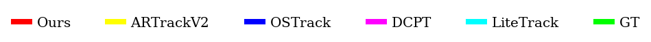
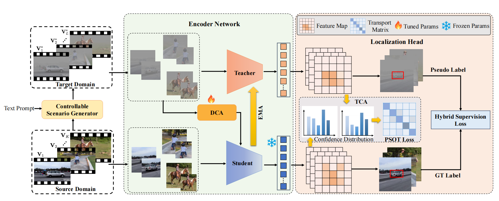
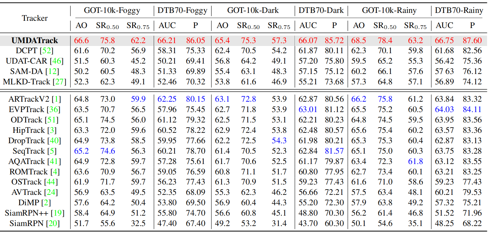

# UMDATrack
The official implementation for the ICCV 2025 paper [_UMDATrack: Unified Multi-Domain Adaptive Tracking
Under Adverse Weather Conditions_](https://arxiv.org/abs/2507.00648)

## Demo




## Introduction

<p align="left">
  
</p>

We present UMDATrack, a unified tracker that adapts to diverse weather conditions with minimal overhead. First, we leverage a text‐conditioned diffusion model to synthesize unlabeled videos under different weather prompts. Then, keeping the backbone fixed, we introduce a lightweight Domain-Customized Adapter (DCA) that quickly remaps object features to each new domain without full model updates. To further align source and target predictions, we add a Target-Aware Confidence Alignment (TCA) module based on optimal transport which enforces consistent localization confidence. With under 2% of additional synthetic frames, UMDATrack outperforms state-of-the-art methods across both real and generated datasets, marking the first unified multi-domain adaptation tracker in the VOT community.

## Performance

<p align="left">
  
</p>

## Install the environment

Create and activate a conda environment:
```
conda create -n UMDATrack python=3.8
conda activate UMDATrack
```
Then install the required packages:
```
bash install.sh
pip install -r requirements.txt
```

## Set project paths

Run the following command to set paths for this project
```
python tracking/create_default_local_file.py --workspace_dir . --data_dir ./data --save_dir ./output
```
After running this command, you can also modify paths by editing these two files
```
lib/train/admin/local.py  # paths about training
lib/test/evaluation/local.py  # paths about testing
```

## Dataset Preparation

Put the tracking datasets in ./data. It should look like this:
```
${PROJECT_ROOT}
 -- data
     -- lasot
         |-- airplane
         |-- basketball
         |-- bear
         ...
     -- got10k
         |-- test
         |-- train
         |-- val
     -- coco
         |-- annotations
         |-- images
     -- trackingnet
         |-- TRAIN_0
         |-- TRAIN_1
         ...
         |-- TRAIN_11
         |-- TEST
     -- got10k_dark
         |-- test
         |-- train
         |-- val   
     -- got10k_haze
         |-- test
         |-- train
         |-- val 
     -- got10k_rainy
         |-- test
         |-- train
         |-- val         
``` 
As it is not trivial to collect large number of video sequences in adverse weather conditions, we first synthesize a small amount of training data to conduct domain knowledge transfer. Inspired by recent advances of text-to-image (T2I) techniques, we use CSG(Controllable Scenario Generator) to generate synthetic multi-domain datasets.Specifically, we feed each selected frame into a text-conditioned diffusion generator (Stable Diffusion-Turbo) using prompts such as “Car in the night,” “Car in the haze,” and “Car in the rain” to produce unlabeled video frames under dark, foggy, and rainy scenarios. And the datasets are now available in [BaiduNetdisk](https://pan.baidu.com/s/1sEn0E3-Kt1X5KZYYovIYYA?pwd=es5c)

## Training

Download our pre-trained [foundation model and initial pseudo-labels](https://pan.baidu.com/s/1Xsn45GZEI35vkv6jEQ0ZHA?pwd=wi9a) which is based on our backbone and put it under  `$PROJECT_ROOT$/pretrained_models`.   
Run the command below to train the model:

### The first stage for the overall training

Since this is a semi-supervised learning setup, please place the initial pseudo-labels in the output folder (e.g., `./output/pseudo_label`), and execute the following command:
```
python tracking/train.py --script UMDATrack --config vit_256_ep250_all --save_dir ./output --mode multiple --nproc_per_node 4  --use_wandb 0
```
Replace `--config` with the desired model config under `experiments/UMDATrack`. We use [wandb](https://github.com/wandb/client) to record detailed training logs, in case you don't want to use wandb, set `--use_wandb 0`.

### The second stage for the domain-customized adapter training

We perform domain adaptation for three weather conditions (dark, haze, rainy). You can find the corresponding configuration files under `experiments/UMDATrack`, and modify the config parameters there to adapt to different domains. Just use dark doamin for instance:
```
python tracking/train.py --script UMDATrack --config vit_256_ep50_dark --save_dir ./output --mode multiple --nproc_per_node 4  --use_wandb 0
```

## Evaluation
Use your own training weights or [ours](https://pan.baidu.com/s/1Xsn45GZEI35vkv6jEQ0ZHA?pwd=wi9a) in `$PROJECT_ROOT$/output/checkpoints/train/UMDATrack`.  

Change the corresponding values of `lib/test/evaluation/local.py` to the actual benchmark saving paths

Testing examples in different domains:
- DTB70 for darkness or other off-line evaluated benchmarks (modify `--dataset` correspondingly)
```
python tracking/test.py UMDATrack vit_256_ep50_dark --dataset dtb70_dark --runid 0001 --ep 50 --save_dir output
python tracking/analysis_results.py # need to modify tracker configs and names
```
- GOT10K-haze(our synthetic dataset)
```
python tracking/test.py UMDATrack vit_256_ep50_haze --dataset got10k_haze --runid 0001 --ep 50 --save_dir output
python lib/test/utils/transform_got10k.py # need to modify tracker configs and names
```
Or you can also use our synthetic DTB70_haze and DTB70_rainy for evaluation.

## Acknowledgement
Our code is built upon [LiteTrack](https://github.com/TsingWei/LiteTrack). Thanks to [One-Step Image Translation with Text-to-Image Models](https://github.com/GaParmar/img2img-turbo) for providing the core CSG architecture and guiding our synthetic dataset creation. Also grateful for PyTracking.

## Citation
If our work is useful for your research, please consider citing:

```
@inproceedings{yao2025umdatrack,
  title={UMDATrack: Unified Multi-Domain Adaptive Tracking Under Adverse Weather Conditions},
  author={Yao, Siyuan and Zhu, Rui and Wang, Ziqi and Ren, Wenqi and Yan, Yanyang and Cao, Xiaochun},
  booktitle={ICCV},
  year={2025}
}
```
